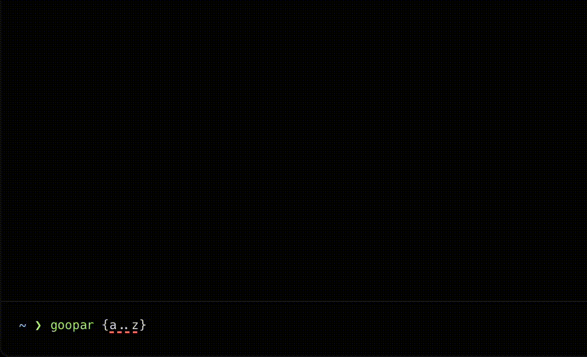

# Good party work out let mash up
is English-like chant that mimics the Japanese group-splitting phrase ("*ぐーとパーでわかれましょ*").

Click the link and hit the speaker to hear the difference.
- [English](https://translate.google.co.jp/?hl=ja&sl=en&tl=ja&text=Good%20party%20work%20out%20let%20mash%20up&op=translate)
- [Japanese](https://translate.google.co.jp/?hl=ja&sl=ja&tl=en&text=ぐーとパーでわかれましょ&op=translate)

## Intall
```bash
go install github.com/tsunematsu21/goopar@latest
```

## Usage
```
$ goopar -h
Usage: goopar [opts...] <args...>
  -m int
    	max times (default 10)
```


